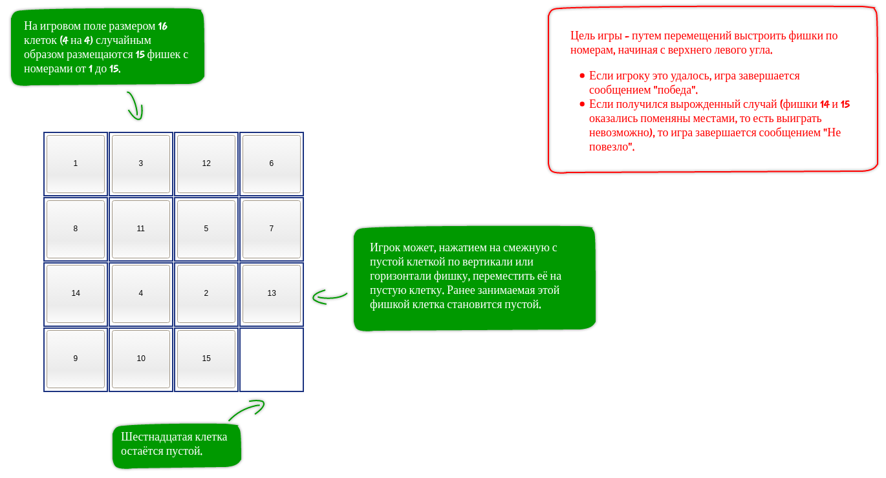
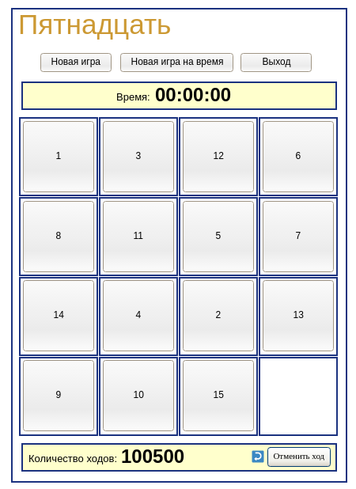
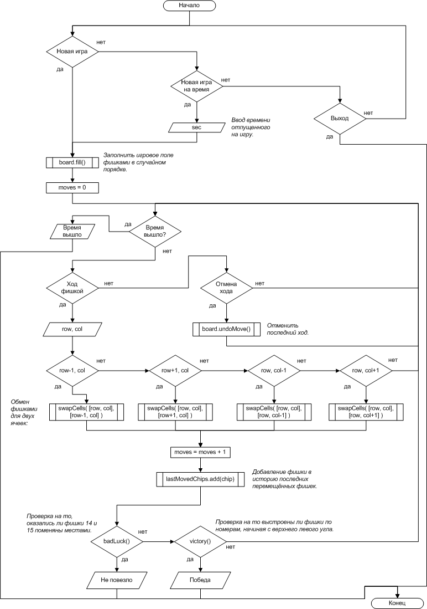

# Problem Statement

Используя классово-объектную структуру написать игру "Пятнадцать".

# Screenshots

## Gameplay

<kbd></kbd>

<kbd></kbd>

<kbd></kbd>

<kbd></kbd>

<kbd></kbd>

## New Project

<kbd></kbd>

<kbd></kbd>

<kbd></kbd>

<kbd></kbd>

# Mockups

<kbd></kbd>

<kbd></kbd>

# Flowchart

<kbd></kbd>

